# TFS Safety Case Processing – Master Architecture (MVP)

**Version:** 1.0  
**Owner:** Sajid (Technical Lead)  
**Status:** Design Review  
**Last Updated:** November 4, 2024

---

## Document Purpose

This master architecture document provides the executive overview and design principles for Thermo Fisher Scientific's Adverse Event (AE) case processing enhancement. It serves as the navigation hub for detailed component designs and implementation guides.

**Target Audience:** Executive stakeholders, technical leads, cross-functional team members

**For Implementation Details:** See component-specific design documents in Section 12 (Document Index)

---

## 1. Executive Summary

We're strengthening the existing Azure Textract-centric AE pipeline by adding a thin, modular intelligence layer on top: a **Layout Registry** with vector search, **embedding-based clustering (ADAH)** to handle "infinite layouts," **auto-generalization** to keep the registry tidy, **client-specific fine-tuning** where accuracy must exceed 90%, and **end-to-end observability**. 

These changes directly answer leadership guidance: optimize **accuracy, auditability, and repeatability**, not platform purity. Preprocessing and final XML publishing remain Phase-2 accelerators once MVP is stable.

### Key Design Tenets
- **Enhance, don't replace:** Build on existing Textract investment
- **Accuracy first:** Multi-source arbitration with measurable improvements (≥5pp)
- **Learn once, reuse forever:** Layout registry prevents re-solving same forms
- **Explainable decisions:** Every extraction choice is auditable with scores
- **Progressive delivery:** MVP focuses on core intelligence; Phase-2 adds polish

### Success Criteria (MVP)
- ✅ **90%+ accuracy** on premium client layouts (vs. 82% baseline)
- ✅ **<60s P95 latency** for 10-page documents
- ✅ **≥80% layout match rate** (known forms auto-routed)
- ✅ **100% auditability** (every field decision logged with reasoning)

---

## 2. System Overview

### 2.1 High-Level Architecture

```
┌─────────────┐
│   Ingest    │ PDF/TIFF arrives
└──────┬──────┘
       │
       ▼
┌─────────────────────────────────────────────────────────┐
│              TEXTRACT (Existing)                        │
│  Structure + Text Extraction (Forms, Tables, Key-Value) │
└──────┬──────────────────────────────────────────────────┘
       │
       ▼
┌──────────────────────────────────────┐
│   NEW INTELLIGENCE LAYER (MVP)       │
│                                      │
│  ┌────────────────────────────────┐ │
│  │  1. Fingerprint & Embed        │ │ ← Layout identification
│  │     (Page structure → vector)   │ │
│  └────────────┬───────────────────┘ │
│               │                      │
│  ┌────────────▼───────────────────┐ │
│  │  2. Layout Registry (KNN)      │ │ ← Match to known layouts
│  │     Postgres + pgvector        │ │
│  └────────────┬───────────────────┘ │
│               │                      │
│  ┌────────────▼───────────────────┐ │
│  │  3. Multi-Extractor Candidates │ │ ← Parallel extraction
│  │     Textract + AOAI (optional) │ │
│  └────────────┬───────────────────┘ │
│               │                      │
│  ┌────────────▼───────────────────┐ │
│  │  4. Arbitration Engine         │ │ ← Winner selection
│  │     Weighted voting + policy   │ │
│  └────────────┬───────────────────┘ │
│               │                      │
│  ┌────────────▼───────────────────┐ │
│  │  5. Schema Validation          │ │ ← Quality gates
│  │     JSON Schema + Semantic     │ │
│  └────────────┬───────────────────┘ │
│               │                      │
│  ┌────────────▼───────────────────┐ │
│  │  6. Client Fine-Tuning (opt)   │ │ ← Premium accuracy
│  │     Custom AOAI models         │ │
│  └────────────┬───────────────────┘ │
└───────────────┼─────────────────────┘
                │
                ▼
         ┌─────────────┐
         │   HITL?     │ Low confidence → human review
         └──────┬──────┘
                │
                ▼
         ┌─────────────┐
         │  Publish    │ Validated JSON + audit trail
         └─────────────┘
                │
                ▼
         ┌─────────────┐
         │Observability│ OpenTelemetry spans + metrics
         └─────────────┘
```

### 2.2 What Changes vs. Current State

| Aspect | Current (Baseline) | MVP Enhancement | Impact |
|--------|-------------------|-----------------|--------|
| **Extraction** | Textract only | Textract + optional AOAI | +5-8pp accuracy |
| **Layout Handling** | Manual mapping per form | Auto-learning registry | 10x faster onboarding |
| **Decision Logic** | Last extractor wins | Arbitration with scoring | Explainable, auditable |
| **Accuracy Monitoring** | Manual spot-checks | Real-time field-level metrics | Proactive quality mgmt |
| **Client Customization** | Not available | Fine-tuned models | 90%+ for premium clients |
| **Observability** | Basic logs | Full OTel tracing | Root cause in <5 min |

---

## 3. Component Map

This system consists of **5 core components** and **3 cross-cutting concerns**. Each component has a detailed design document (see Section 12).

### 3.1 Core Components

#### **Layout Registry** 
📄 [Detailed Design →](02-Component-Designs/Registry-Design.md)

- **Purpose:** KNN-based layout matching to identify document structure
- **Technology:** Postgres + pgvector (IVFFlat index)
- **Key Capability:** Match incoming document to known layout in <100ms
- **Owner:** Sajid
- **MVP Status:** ✅ Critical path

**Why It Matters:** Eliminates manual form mapping; learns layout once, reuses forever. Handles "infinite variations" (same form, different scanner settings).

---

#### **Clustering Engine (ADAH)**
📄 [Detailed Design →](02-Component-Designs/Clustering-ADAH-Design.md)

- **Purpose:** Auto-generalization to prevent registry bloat
- **Technology:** HDBSCAN + cosine similarity on embeddings
- **Key Capability:** Merge 100 layout variants into 1 reusable cluster
- **Owner:** Helios (Data/ML Lead)
- **MVP Status:** ✅ Critical path

**Why It Matters:** Without clustering, registry would grow to millions of near-duplicate entries. ADAH keeps it manageable (<100k entries).

---

#### **Arbitration Engine**
📄 [Detailed Design →](02-Component-Designs/Arbitration-Design.md)

- **Purpose:** Multi-extractor fusion and winner selection per field
- **Technology:** Weighted voting algorithm + policy-driven rules
- **Key Capability:** Choose best extraction result with explainable scoring
- **Owner:** Sajid (implementation) + Yash (policy definitions)
- **MVP Status:** ✅ Critical path

**Why It Matters:** Improves accuracy by combining strengths of multiple extractors. Every decision is auditable (scores + reasoning logged).

---

#### **Client Fine-Tuning**
📄 [Detailed Design →](02-Component-Designs/ClientFineTuning-Design.md)

- **Purpose:** Premium accuracy (≥90%) via client-specific AOAI models
- **Technology:** Azure OpenAI fine-tuning + prompt engineering
- **Key Capability:** Custom extraction models for high-value clients
- **Owner:** Helios
- **MVP Status:** ✅ For 1-2 premium clients; expand in Phase-2

**Why It Matters:** Generic models hit ~82% accuracy. Fine-tuning on client's corrected data reaches 90%+, justifying premium pricing.

---

#### **Observability Stack**
📄 [Detailed Design →](02-Component-Designs/Observability-Design.md)

- **Purpose:** End-to-end tracing, accuracy metrics, and drift detection
- **Technology:** OpenTelemetry + Azure Application Insights
- **Key Capability:** Field-level accuracy dashboards; anomaly detection
- **Owner:** Sajid (architecture) + DevOps (operations)
- **MVP Status:** ✅ Critical for MVP validation

**Why It Matters:** Without observability, we can't prove the 5pp accuracy improvement. Real-time metrics enable proactive quality management.

---

### 3.2 Cross-Cutting Concerns

#### **Data Models & APIs**
📄 [Schema Reference →](03-Cross-Cutting/Data-Models-Schema.md)

- Database schemas (Postgres tables, indexes, constraints)
- API contracts (request/response formats, error codes)
- Message formats (event schemas, queue payloads)

#### **Error Handling & Resilience**
📄 [Strategy Guide →](03-Cross-Cutting/Error-Handling-Strategy.md)

- Retry policies per component
- Circuit breaker patterns
- Fallback mechanisms (degraded mode operation)

#### **Performance & Scalability**
📄 [Benchmark Report →](03-Cross-Cutting/Performance-Scalability.md)

- Latency targets (P50/P95/P99)
- Throughput requirements (docs/hour)
- Scalability limits and mitigation strategies

#### **Security & Compliance**
📄 [Compliance Guide →](03-Cross-Cutting/Security-Compliance.md)

- PHI handling (encryption, access controls)
- Audit requirements (FDA 21 CFR Part 11)
- Data retention policies

---

## 4. Design Principles

### Accuracy First
**Choose the best extractor output via arbitration; measure everything.**

Implementation: Every field extraction is scored. Winner is chosen via weighted voting considering source reliability, field difficulty, and historical accuracy. No "black box" decisions.

### Config > Code
**Policies, thresholds, model routing live in config, not code.**

Implementation: YAML-based policies define extractor weights, validation rules, and routing logic. Changes don't require redeployment—hot-reload from blob storage.

### Reusable Intelligence
**Learn layout once, reuse via registry; prevent registry bloat via clustering/generalization.**

Implementation: Vector embeddings enable semantic similarity matching. ADAH clustering automatically merges similar layouts, keeping registry size manageable.

### Human-in-the-Loop (HITL)
**Corrections flow back to training/fine-tuning.**

Implementation: Low-confidence extractions route to human reviewers. Corrections are versioned and feed into fine-tuning datasets (stored in Databricks Delta tables).

### Audit Everywhere
**Every decision is explainable (scores, winner, reason).**

Implementation: OpenTelemetry spans capture decision trees. Every field has: extracted_value, confidence, winner_source, loser_scores, policy_version, timestamp. Queryable via Azure Data Explorer.

---

## 5. Detailed Data Flow

### 5.1 End-to-End Processing Pipeline

```mermaid
sequenceDiagram
    participant I as Ingest
    participant T as Textract
    participant F as Fingerprint
    participant R as Registry (KNN)
    participant E as Extractors
    participant A as Arbitration
    participant V as Validation
    participant P as Publish
    participant H as HITL Queue
    
    I->>T: PDF/TIFF document
    T->>F: Raw text + structure
    F->>F: Generate embedding (768-dim)
    F->>R: KNN search (top-5, τ=0.75)
    
    alt Match Found (similarity ≥ 0.75)
        R->>R: Load policy_id
        R->>E: Route with known policy
    else No Match
        R->>R: Use generic policy
        R->>R: Mark as candidate_new
    end
    
    par Parallel Extraction
        E->>E: Textract (existing)
        E->>E: AOAI GPT-4 (if enabled)
    end
    
    E->>A: Candidate results[]
    A->>A: Score per field
    A->>A: Apply policy weights
    A->>V: Winner + metadata
    
    V->>V: JSON schema check
    V->>V: RxNorm/MedDRA lookup
    
    alt Validation Pass & High Confidence
        V->>P: Write JSON + audit
        P->>P: Success
    else Validation Fail OR Low Confidence
        V->>H: Queue for HITL
        H->>H: Human review
        H->>P: Corrected data
        H->>E: Feedback for training
    end
```



### 5.2 Component Interaction Summary

| Step | Component | Input | Output | Decision Point |
|------|-----------|-------|--------|----------------|
| 1 | Ingest | PDF/TIFF | Binary blob | — |
| 2 | Textract | Document | Text + structure JSON | — |
| 3 | Fingerprint | Structure JSON | 768-dim vector | — |
| 4 | Registry | Vector | policy_id OR generic | Similarity ≥ τ ? |
| 5 | Extractors | Document + policy | Candidates[] | — |
| 6 | Arbitration | Candidates[] | Winner per field | Weighted scores |
| 7 | Validation | Winner JSON | Pass/Fail + reasons | Schema + semantic |
| 8 | Publish/HITL | Validated JSON | Storage OR queue | Confidence ≥ threshold ? |

**For detailed flows per component:**
- Registry lookup flow → [Registry-Design.md, Section 3](02-Component-Designs/Registry-Design.md#3-detailed-algorithms)
- Arbitration decision tree → [Arbitration-Design.md, Section 2](02-Component-Designs/Arbitration-Design.md#2-decision-logic)
- HITL feedback loop → [ClientFineTuning-Design.md, Section 4](02-Component-Designs/ClientFineTuning-Design.md#4-feedback-loop)

---

## 6. Scope: MVP vs. Phase-2

### 6.1 MVP Scope (Phase-1: Months 1-3)

**Goal:** Prove the intelligence layer improves accuracy and auditability

| Capability | Included | Success Metric |
|------------|----------|----------------|
| Layout Registry (Postgres + pgvector) | ✅ | Match rate ≥80% |
| Embedding-based Clustering (ADAH) | ✅ | Registry size <100k entries |
| Layout Generalization (auto-merge) | ✅ | Merge ratio ≥10:1 |
| Client-Specific Fine-Tuning | ✅ (1-2 clients) | Accuracy ≥90% |
| Observability & Metrics | ✅ | Field-level dashboards live |
| Arbitration + Validation | ✅ | +5pp accuracy improvement |
| **Publishing** | **JSON only** | Audit trail queryable |
| **Preprocessing** | **Manual** | — |

### 6.2 Phase-2 Scope (Months 4-6)

**Goal:** Production hardening and operational polish

| Capability | Description | Benefit |
|------------|-------------|---------|
| Automated Preprocessing | OpenCV deskewing, Azure Vision denoising | +2-3pp accuracy on poor scans |
| XML Publishing Path | Azure Function + contract validation | Client system integration |
| Expanded Fine-Tuning | 5+ client profiles | Premium tier revenue |
| Advanced Business Rules | Cross-form validation, temporal checks | Catch logical errors |
| SLO Enforcement | Auto-scaling, anomaly detection models | 99.5% uptime |

**Why This Split?**  
Keeps MVP laser-focused on core intelligence (what leadership asked for), while deferring operational polish until framework is proven.

---

## 7. Functional Requirements (Key SLAs)

### 7.1 Accuracy Requirements

| Metric | Baseline (Current) | MVP Target | Measurement Method |
|--------|-------------------|------------|-------------------|
| **Field-level accuracy (overall)** | 82% | ≥87% | Gold-standard test set (N=500) |
| **Premium client accuracy** | 82% | ≥90% | Client-specific test set (N=100) |
| **Layout match precision** | N/A | ≥0.90 | KNN retrieval @ top-1 |
| **Layout match recall** | N/A | ≥0.85 | Known layouts in test set |

### 7.2 Performance Requirements

| Metric | Target | Measurement |
|--------|--------|-------------|
| **End-to-end latency** | ≤60s @ P95 (10-page doc) | OTel trace duration |
| **Registry KNN search** | ≤100ms @ P95 | Postgres query time |
| **Arbitration** | ≤2s per doc | Component span duration |
| **Throughput** | 1000 docs/hour sustained | Queue processing rate |

### 7.3 Quality Requirements

| Metric | Target | Detection Method |
|--------|--------|-----------------|
| **HITL rate** | ≤15% of documents | Confidence threshold triggers |
| **Schema validation failure** | ≤5% of extractions | Validation component logs |
| **Drift alert response time** | ≤24 hours | Automated anomaly detection |

---

## 8. Non-Functional Requirements

### 8.1 Auditability

**Requirement:** Every extraction decision must be explainable and traceable.

**Implementation:**
- Store winners, losers, scores, thresholds, policy version per field
- OpenTelemetry trace IDs link all processing steps
- Queryable via Azure Data Explorer (KQL): "Show me why field X was extracted as Y"

**Compliance:** Supports FDA 21 CFR Part 11 audit requirements

📄 [Full Compliance Mapping →](03-Cross-Cutting/Security-Compliance.md#audit-trail)

### 8.2 Security

**Requirement:** PHI protection in accordance with HIPAA

**Implementation:**
- Encryption at rest: Azure Storage with Microsoft-managed keys
- Encryption in transit: TLS 1.3 for all API calls
- Access control: Azure Managed Identity; RBAC on key services
- Secrets management: Azure Key Vault (no secrets in code/config)

📄 [Security Architecture →](03-Cross-Cutting/Security-Compliance.md#phi-handling)

### 8.3 Reliability

**Requirement:** Idempotent processing; graceful degradation

**Implementation:**
- Deduplication: Document hash checked before processing (skip if already processed)
- Retry policies: Exponential backoff on transient failures (max 3 retries)
- Poison queue: Failed documents after 3 retries → manual investigation
- Circuit breakers: Registry unavailable → fallback to generic policy

📄 [Error Handling Strategy →](03-Cross-Cutting/Error-Handling-Strategy.md)

### 8.4 Performance & Scalability

**Targets:**
- P95 end-to-end latency: ≤60s for 10-page doc
- Sustained throughput: 1000 docs/hour
- Burst capacity: 2000 docs/hour for 15 minutes
- Registry scale: Support 50k-100k layouts without degradation

📄 [Performance Benchmarks →](03-Cross-Cutting/Performance-Scalability.md)

### 8.5 Privacy & Data Retention

**Requirement:** Retain HITL artifacts per client-approved policy

**Implementation:**
- Original documents: 90-day retention (configurable per client)
- HITL corrections: 2-year retention (training data)
- Audit logs: 7-year retention (regulatory compliance)
- PII redaction: Optional per client contract

📄 [Data Retention Policy →](03-Cross-Cutting/Security-Compliance.md#retention)

---

## 9. Workplan & Milestones

### Month 1: Foundation
**Goal:** Core infrastructure operational

- [x] **Week 1-2:** Postgres + pgvector setup; schema migrations; seed 100 sample layouts
- [x] **Week 3:** Implement fingerprint generation; embedding pipeline (text-embedding-3-small)
- [x] **Week 4:** KNN search endpoint; baseline performance tests (<100ms @ 50k vectors)

**Deliverables:**
- ✅ Registry API operational (search + insert)
- ✅ Integration test: 1000 layouts searchable with >0.9 precision

---

### Month 2: Intelligence Layer
**Goal:** Arbitration and clustering operational

- [ ] **Week 5-6:** Arbitration skeleton + baseline policy; JSON schema validator
- [ ] **Week 7:** RxNorm/MedDRA semantic lookup integration
- [ ] **Week 8:** ADAH clustering implementation; auto-merge logic; drift metrics

**Deliverables:**
- ✅ Arbitration improves accuracy by ≥5pp vs. Textract-only (test set validation)
- ✅ HITL hooks operational (CSV export/import for MVP)
- ✅ Accuracy dashboard live (field-level metrics by layout/client)

---

### Month 3: Client Fine-Tuning & MVP Sign-Off
**Goal:** Premium accuracy demonstrated; MVP validated

- [ ] **Week 9-10:** First premium client profile; fine-tuning run on HITL-corrected data
- [ ] **Week 11:** Policy re-weighting using live outcome data; SLA/alert rules
- [ ] **Week 12:** MVP acceptance testing; performance validation; sign-off

**Deliverables:**
- ✅ Premium client reaches ≥90% accuracy on target layouts
- ✅ Observability: full OTel tracing + App Insights dashboards
- ✅ MVP documentation complete (all component designs + runbooks)

**Go/No-Go Decision:** Proceed to Phase-2 if:
- ✅ Overall accuracy ≥87% (vs. 82% baseline)
- ✅ P95 latency <60s for 10-page docs
- ✅ No critical security/compliance findings

---

## 10. RACI Matrix

| Responsibility | Accountable | Responsible | Consulted | Informed |
|----------------|-------------|-------------|-----------|----------|
| **Architecture Design** | Sajid | Sajid | Helios, Yash | Team |
| **Layout Registry** | Sajid | Sajid + Dev Team | — | Yash |
| **Clustering (ADAH)** | Helios | Helios + Data Team | Sajid | — |
| **Arbitration Logic** | Sajid | Sajid | Yash (policies) | Helios |
| **Policy Definitions** | Yash | Yash | Sajid, Helios | Team |
| **AOAI Fine-Tuning** | Helios | Helios + ML Team | Sajid | Yash |
| **Observability Stack** | Sajid | Sajid + DevOps | — | Team |
| **HITL Workflow** | Product | QA Team | Eng Team | Yash |
| **Security/Compliance** | Yash | Sajid + Security | Legal | Team |
| **Testing Strategy** | Sajid | QA Lead | Dev Team | Yash |

---

## 11. Dependencies & Risks

### 11.1 External Dependencies

| Dependency | Owner | Risk Level | Mitigation |
|------------|-------|------------|-----------|
| **JSON Schema (authoritative)** | Yash | 🟡 Medium | Weekly sync; schema versioning |
| **AOAI Deployment Quotas** | Helios | 🟡 Medium | Pre-provision GPT-4 capacity; fallback to Textract-only |
| **RxNorm/MedDRA Access** | Data Team | 🟢 Low | Use cached tables if API unavailable |
| **Sample Set Coverage** | Product/QA | 🟡 Medium | Prioritize high-volume layout types first |

### 11.2 Key Risks

| Risk | Impact | Probability | Mitigation Strategy |
|------|--------|-------------|---------------------|
| **Registry KNN performance degrades at scale** | High | Medium | Pre-emptive load testing; IVFFlat tuning; consider sharding at 100k |
| **ADAH clustering merges incompatible layouts** | Medium | Low | Silhouette score validation; manual approval for questionable merges |
| **AOAI rate limits during fine-tuning** | Medium | Medium | Stagger fine-tuning runs; use async batch API |
| **Textract accuracy regression on new form types** | High | Low | Continuous monitoring; alert on accuracy drop >5pp |
| **HITL backlog grows faster than review capacity** | High | Medium | Auto-escalate; prioritize by client SLA; expand reviewer pool |

### 11.3 Open Questions

| Question | Decision Deadline | Owner |
|----------|------------------|-------|
| Final JSON schema for Phase-2 XML mapping? | End of Month 2 | Yash |
| Max acceptable registry size before sharding? | End of Month 1 | Sajid + Helios |
| Support multiple embedding models simultaneously? | End of Month 1 | Helios |
| Layout drift handling strategy (gradual changes)? | Month 2 spike | Sajid |
| HITL UI requirements (beyond CSV)? | Phase-2 planning | Product |

---

## 12. Document Index

### Core Documentation

| Document | Purpose | Owner | Status |
|----------|---------|-------|--------|
| **[00-MASTER-Architecture.md](00-MASTER-Architecture.md)** | This document (executive overview) | Sajid | ✅ Draft v1.0 |
| **[01-Data-Flow-Diagrams.md](01-Data-Flow-Diagrams.md)** | Visual system flows (Mermaid diagrams) | Sajid | 🔄 In Progress |

### Component Deep-Dives

| Document | Component | Owner | Status |
|----------|-----------|-------|--------|
| **[Registry-Design.md](02-Component-Designs/Registry-Design.md)** | Layout Registry (Postgres + pgvector) | Sajid | 🔄 In Progress |
| **[Clustering-ADAH-Design.md](02-Component-Designs/Clustering-ADAH-Design.md)** | Embedding-based clustering | Helios | ⏳ Planned |
| **[Arbitration-Design.md](02-Component-Designs/Arbitration-Design.md)** | Multi-extractor winner selection | Sajid | ⏳ Planned |
| **[ClientFineTuning-Design.md](02-Component-Designs/ClientFineTuning-Design.md)** | Premium accuracy profiles | Helios | ⏳ Planned |
| **[Observability-Design.md](02-Component-Designs/Observability-Design.md)** | OTel tracing + metrics | Sajid + DevOps | ⏳ Planned |

### Cross-Cutting Concerns

| Document | Topic | Owner | Status |
|----------|-------|-------|--------|
| **[Data-Models-Schema.md](03-Cross-Cutting/Data-Models-Schema.md)** | DB schemas, API contracts | Sajid | ⏳ Planned |
| **[Error-Handling-Strategy.md](03-Cross-Cutting/Error-Handling-Strategy.md)** | Retry logic, fallbacks, circuit breakers | Sajid | ⏳ Planned |
| **[Security-Compliance.md](03-Cross-Cutting/Security-Compliance.md)** | PHI, encryption, audit, FDA compliance | Yash + Sajid | ⏳ Planned |
| **[Performance-Scalability.md](03-Cross-Cutting/Performance-Scalability.md)** | Benchmarks, bottlenecks, scale limits | Sajid + DevOps | ⏳ Planned |

### Testing & Quality

| Document | Topic | Owner | Status |
|----------|-------|-------|--------|
| **[Testing-Strategy.md](04-Testing/Testing-Strategy.md)** | Unit, integration, accuracy tests | QA Lead | ⏳ Planned |
| **[Test-Data-Requirements.md](04-Testing/Test-Data-Requirements.md)** | Gold-standard datasets, coverage | Product + QA | ⏳ Planned |

### Implementation Guides

| Document | Purpose | Owner | Status |
|----------|---------|-------|--------|
| **[Developer-Setup-Guide.md](05-Implementation/Developer-Setup-Guide.md)** | Local environment setup (30 min) | Sajid | ⏳ Planned |
| **[Build-Order-Runbook.md](05-Implementation/Build-Order-Runbook.md)** | Week-by-week implementation plan | Sajid | ⏳ Planned |
| **[Configuration-Examples/](05-Implementation/Configuration-Examples/)** | Sample YAML policies, client profiles | Yash + Sajid | ⏳ Planned |

### Operations

| Document | Purpose | Owner | Status |
|----------|---------|-------|--------|
| **[Deployment-Guide.md](06-Operations/Deployment-Guide.md)** | CI/CD, environment config | DevOps | ⏳ Planned |
| **[Monitoring-Runbook.md](06-Operations/Monitoring-Runbook.md)** | Dashboards, alerts, SLOs | DevOps | ⏳ Planned |
| **[Troubleshooting-FAQ.md](06-Operations/Troubleshooting-FAQ.md)** | Common issues, resolutions | Sajid + DevOps | ⏳ Planned |

---

## 13. Architecture Decision Records (ADRs)

### Why pgvector over Pinecone/Weaviate?

**Decision:** Use Postgres pgvector extension instead of dedicated vector database

**Context:** Need KNN search for 50k-100k layout embeddings with <100ms P95 latency

**Rationale:**
- ✅ Co-locate with relational data (policies, audit logs) → simpler data model
- ✅ IVFFlat index supports our scale and latency requirements
- ✅ Lower operational complexity (one database vs. two services)
- ✅ Cost: ~$200/mo for Postgres vs. ~$800/mo for Pinecone at our scale

**Trade-offs:**
- ❌ Not as fast as Pinecone at >1M vectors (not a concern for MVP)
- ❌ Less mature ecosystem for vector operations
- ✅ Can migrate to dedicated vector DB in Phase-2 if needed (embeddings portable)

**Status:** Approved | **Owner:** Sajid | **Date:** 2024-11-01

---

### Why HDBSCAN over K-means for clustering?

**Decision:** Use density-based clustering (HDBSCAN) instead of K-means

**Context:** Need to auto-merge similar layouts without knowing cluster count upfront

**Rationale:**
- ✅ HDBSCAN doesn't require pre-specifying number of clusters (k)
- ✅ Handles variable-density clusters (some forms have 100 variants, others have 5)
- ✅ Automatically identifies noise/outliers (truly unique layouts)
- ✅ Better silhouette scores on our test data (0.72 vs. 0.54 for K-means)

**Trade-offs:**
- ❌ Slightly slower than K-means (acceptable for batch processing)
- ❌ Requires tuning min_cluster_size parameter (set via grid search)

**Status:** Approved | **Owner:** Helios | **Date:** 2024-11-02

**Reference:** [Clustering-ADAH-Design.md, Section 2](02-Component-Designs/Clustering-ADAH-Design.md#2-algorithm-selection)

---

### Why weighted voting over ML-based arbitration?

**Decision:** Use rule-based weighted voting for arbitration instead of ML model

**Context:** Need to combine results from multiple extractors (Textract, AOAI)

**Rationale:**
- ✅ **Explainability:** Every decision has a clear audit trail (scores, weights, policy version)
- ✅ **Simplicity:** No training data needed; no model drift to manage
- ✅ **Debuggability:** Can manually tune weights; easy to identify when/why it fails
- ✅ **Regulatory:** Rule-based systems are easier to validate for FDA compliance

**Trade-offs:**
- ❌ May not capture complex interactions between extractors
- ❌ Requires manual tuning of weights (mitigated by HITL feedback loop)
- ✅ Can add ML arbitration in Phase-2 if simple voting plateaus

**Status:** Approved | **Owner:** Sajid + Yash | **Date:** 2024-11-03

**Reference:** [Arbitration-Design.md, Section 1](02-Component-Designs/Arbitration-Design.md#1-design-rationale)

---

## 14. Glossary

| Term | Definition |
|------|------------|
| **ADAH** | Adaptive Document Abstraction Hierarchy - our clustering algorithm |
| **AE** | Adverse Event (primary use case: AE form processing) |
| **AOAI** | Azure OpenAI Service |
| **Arbitration** | Process of selecting best extraction result from multiple candidates |
| **Embedding** | 768-dimensional vector representation of document layout |
| **Fingerprint** | Structural hash of document layout (bbox positions, text density, etc.) |
| **HDBSCAN** | Hierarchical Density-Based Spatial Clustering (density-based clustering algorithm) |
| **HITL** | Human-in-the-Loop (manual review/correction workflow) |
| **KNN** | K-Nearest Neighbors (vector similarity search algorithm) |
| **Layout** | Unique document structure/template (e.g., "FDA 3500A form v2") |
| **OTel** | OpenTelemetry (distributed tracing standard) |
| **pgvector** | Postgres extension for vector similarity search |
| **Policy** | Configuration defining extractor weights, validation rules for a layout |
| **SAE** | Serious Adverse Event (subset of AE with higher severity) |
| **Semantic Validation** | Business logic checks (RxNorm, MedDRA lookups, cross-field rules) |

---

## 15. Approval & Sign-Off

| Role | Name | Signature | Date |
|------|------|-----------|------|
| **Technical Lead** | Sajid | _____________ | ________ |
| **Data/ML Lead** | Helios | _____________ | ________ |
| **Product Owner** | Yash | _____________ | ________ |
| **Architecture Review** | [TBD] | _____________ | ________ |
| **Security Review** | [TBD] | _____________ | ________ |

---

## Revision History

| Version | Date | Author | Changes |
|---------|------|--------|---------|
| 0.1 | 2024-11-01 | Sajid | Initial draft (sections 1-4) |
| 0.2 | 2024-11-03 | Sajid | Added component map, ADRs, workplan |
| 1.0 | 2024-11-04 | Sajid | Enhanced with document index, visual flows, approval section |

---

**Next Steps:**
1. Review with Helios (focus on clustering + fine-tuning approach)
2. Review with Yash (focus on arbitration policies + validation rules)
3. Finalize component design documents (Registry, Arbitration priority)
4. Schedule architecture review board (ARB) presentation

**Questions or feedback?** Contact Sajid (Technical Lead)
