# TFS Safety Case Processing – Data Flow Diagrams

**Version:** 1.0  
**Owner:** Sajid (Technical Lead)  
**Last Updated:** November 4, 2024

---

## Document Purpose

This document provides visual representations of data flows within the TFS AE pipeline enhancement. Diagrams are organized by abstraction level: system context, component interactions, and detailed process flows.

**Diagram Format:** Mermaid (renders in GitHub, Azure DevOps, and most markdown viewers)

**Related Documents:**
- [Master Architecture](00-MASTER-Architecture.md) - System overview and design principles
- [Component Designs](02-Component-Designs/) - Detailed component specifications

---

## 1. System Context (Level 0)

### 1.1 External System Integration

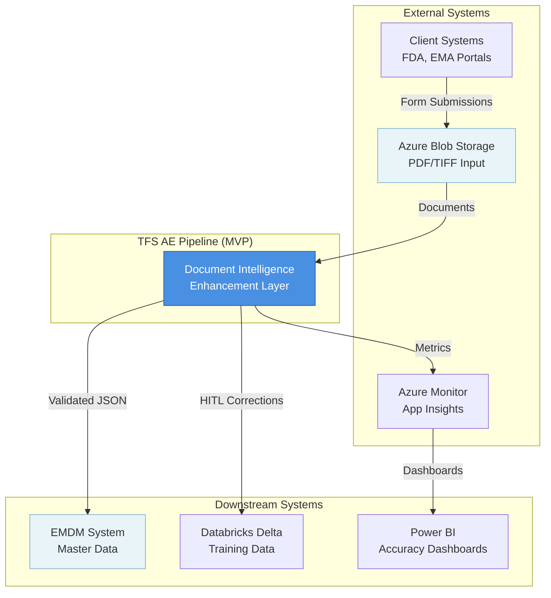

### 1.2 Data Flow Summary

| Source | Destination | Data Type | Volume | Frequency |
|--------|-------------|-----------|--------|-----------|
| Client Systems → Blob Storage | PDF/TIFF documents | ~2-50 pages | 1000/day | Continuous |
| Blob Storage → Pipeline | Binary blobs | 1-20 MB | 1000/day | Event-driven |
| Pipeline → EMDM | Validated JSON | 10-100 KB | 850/day | Real-time |
| Pipeline → HITL Queue | Low-confidence extractions | 10-100 KB | 150/day | Real-time |
| HITL → Databricks | Corrected labels | 10-50 KB | 150/day | Batch (hourly) |

---

## 2. Component Interaction (Level 1)

### 2.1 End-to-End Processing Flow

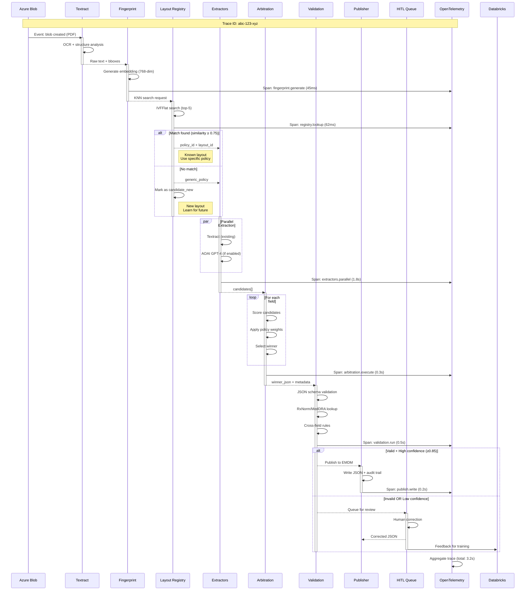

### 2.2 Component Dependencies

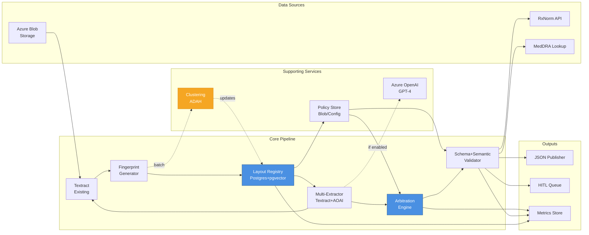

---

## 3. Detailed Process Flows (Level 2)

### 3.1 Registry Lookup Flow

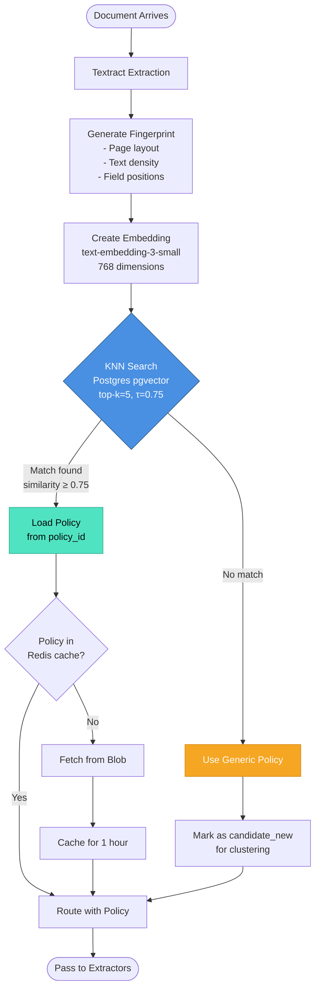

**Key Decision Points:**

| Decision | Criteria | Outcome |
|----------|----------|---------|
| **Similarity threshold met?** | cosine_similarity ≥ 0.75 | Use matched policy vs. generic |
| **Policy cached?** | Redis lookup (key: policy_id) | Fast path vs. blob fetch |
| **Mark as new layout?** | No match OR similarity < 0.50 | Queue for clustering analysis |

**Performance Characteristics:**

```
KNN Search:        42ms @ P50, 87ms @ P95 (50k vectors)
Policy Load (hit): 2ms (Redis)
Policy Load (miss): 45ms (Blob fetch + parse)
Total Latency:     ~50-130ms
```

---

### 3.2 Arbitration Decision Tree

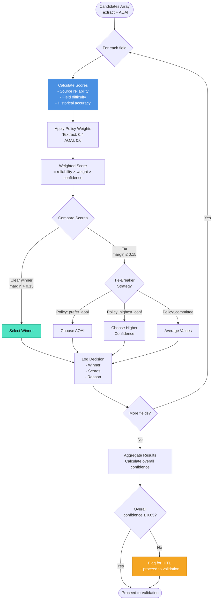

**Scoring Formula:**

```python
weighted_score = (
    source_reliability[source]  # 0.85 (Textract) vs 0.92 (AOAI)
    × policy_weight[field][source]  # e.g., 0.4 vs 0.6
    × candidate_confidence  # 0.0-1.0 from extractor
    × (1 - field_difficulty[field])  # 0.3 (easy) vs 0.9 (hard)
)

# Example calculation:
# Field: patient_name, Textract candidate
# = 0.85 × 0.4 × 0.95 × (1 - 0.3)
# = 0.85 × 0.4 × 0.95 × 0.7
# = 0.226

# Field: patient_name, AOAI candidate
# = 0.92 × 0.6 × 0.88 × 0.7
# = 0.342  ← Winner
```

**Tie-Breaker Strategies (configurable per field):**

| Strategy | When to Use | Example |
|----------|-------------|---------|
| `prefer_aoai` | Unstructured text (narratives) | Event descriptions |
| `prefer_textract` | Structured fields (dates, IDs) | Form numbers, dates |
| `highest_confidence` | No strong preference | Phone numbers |
| `committee_average` | Numeric values | Dosage amounts |

---

### 3.3 Validation Pipeline

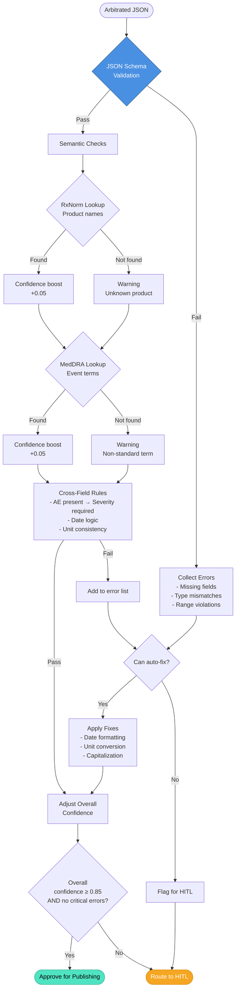

**Validation Rules Hierarchy:**

```
1. Schema Validation (blocking)
   └─ Required fields present
   └─ Data types correct (string, number, date)
   └─ Range constraints (e.g., age 0-120)

2. Semantic Validation (warning)
   └─ RxNorm product lookup
   └─ MedDRA event term lookup
   └─ Unit standardization (mg vs g)

3. Business Logic (blocking or warning)
   └─ Cross-field consistency
   └─ Temporal logic (report_date ≥ event_date)
   └─ Conditional requirements (if X then Y must exist)
```

**Auto-Fix Capabilities:**

| Issue | Auto-Fix Strategy | Example |
|-------|------------------|---------|
| Date format inconsistency | Parse + reformat to ISO 8601 | "10/15/2024" → "2024-10-15" |
| Unit mismatch | Convert to standard unit | "1000mg" → "1g" |
| Case sensitivity | Title case for names | "john doe" → "John Doe" |
| Whitespace | Trim and normalize | "  ABC  " → "ABC" |

---

### 3.4 HITL Feedback Loop

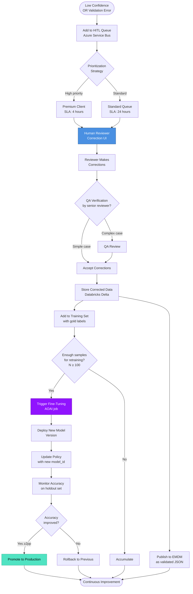

**HITL Queue Prioritization:**

| Priority | Criteria | SLA | Routing |
|----------|----------|-----|---------|
| **Critical** | Premium client + SAE form | 2 hours | Senior reviewer |
| **High** | Premium client OR complex extraction | 4 hours | Any reviewer |
| **Standard** | Standard client + simple form | 24 hours | Any reviewer |
| **Low** | Training data collection only | 7 days | Batch processing |

**Fine-Tuning Trigger Logic:**

```python
if training_set_size >= 100:
    if last_training_date is None or days_since_training >= 30:
        if new_samples_since_training >= 100:
            trigger_fine_tuning()
```

---

### 3.5 Clustering (ADAH) Batch Process

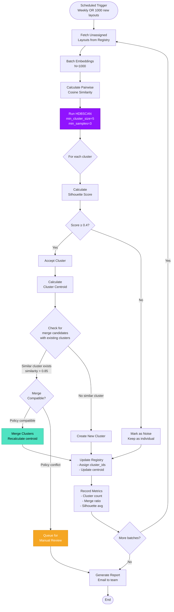

**Clustering Parameters (Tuned):**

| Parameter | Value | Rationale |
|-----------|-------|-----------|
| `min_cluster_size` | 5 | At least 5 similar layouts to form cluster |
| `min_samples` | 3 | Core points need 3 neighbors |
| `metric` | cosine | Best for high-dimensional embeddings |
| `merge_threshold` | 0.85 | High similarity to prevent over-merging |

**Merge Compatibility Check:**

```python
def are_clusters_mergeable(c1: Cluster, c2: Cluster) -> bool:
    # 1. Centroid similarity
    if cosine_similarity(c1.centroid, c2.centroid) < 0.85:
        return False
    
    # 2. Policy compatibility
    if c1.policy_type != c2.policy_type:
        return False
    
    # 3. Silhouette score won't degrade
    merged_silhouette = calculate_silhouette(c1.members + c2.members)
    if merged_silhouette < min(c1.silhouette, c2.silhouette):
        return False
    
    # 4. Size constraint (prevent megaclusters)
    if len(c1.members) + len(c2.members) > 500:
        return False
    
    return True
```

---

## 4. Data State Transitions

### 4.1 Document Lifecycle State Machine

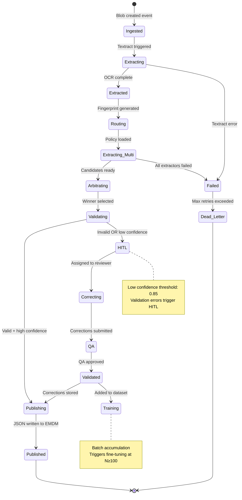

**State Persistence:**

```sql
CREATE TABLE document_processing_state (
    document_id UUID PRIMARY KEY,
    current_state VARCHAR(50) NOT NULL,
    state_history JSONB[],
    last_updated TIMESTAMP DEFAULT NOW(),
    error_count INT DEFAULT 0,
    metadata JSONB,
    
    CONSTRAINT valid_state CHECK (
        current_state IN (
            'ingested', 'extracting', 'extracted', 'routing',
            'extracting_multi', 'arbitrating', 'validating',
            'publishing', 'hitl', 'correcting', 'qa',
            'validated', 'training', 'published', 'failed'
        )
    )
);
```

---

## 5. Error Handling Flows

### 5.1 Registry Failure Fallback

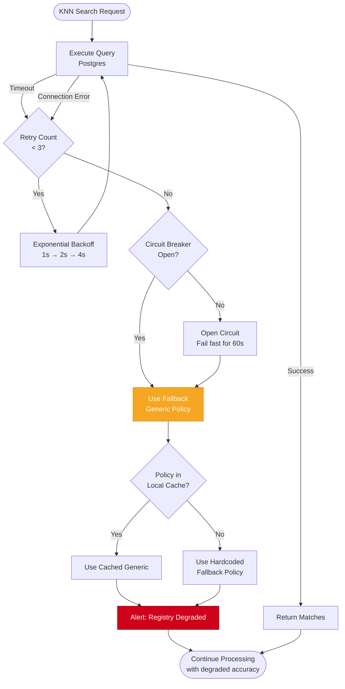

**Circuit Breaker Configuration:**

```yaml
circuit_breaker:
  failure_threshold: 5  # Open after 5 consecutive failures
  success_threshold: 2  # Close after 2 consecutive successes
  timeout: 60s          # Stay open for 60 seconds
  half_open_max_calls: 3  # Test with 3 requests in half-open state
```

---

### 5.2 Arbitration Conflict Resolution

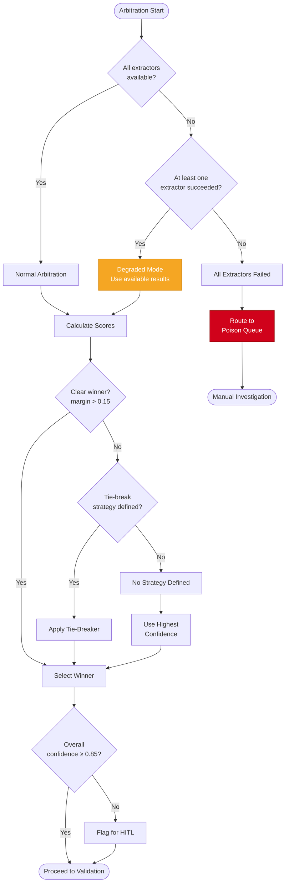

---

## 6. Monitoring & Observability

### 6.1 OpenTelemetry Trace Hierarchy

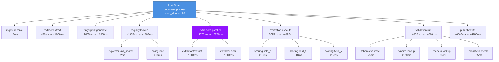

**Trace Attributes (Key):**

```json
{
  "trace.id": "abc-123-xyz",
  "span.name": "document.process",
  "document.id": "550e8400-...",
  "document.type": "AE_FORM",
  "document.page_count": 4,
  "layout.matched": true,
  "layout.similarity": 0.92,
  "policy.id": "7c9e6679-...",
  "arbitration.winner_source": "aoai",
  "arbitration.confidence": 0.91,
  "validation.passed": true,
  "hitl.required": false,
  "duration_ms": 4785
}
```

---

### 6.2 Metrics Dashboard Structure

```mermaid
graph TB
    subgraph "Real-Time Metrics"
        Throughput[docs_processed_total<br/>counter]
        Latency[processing_duration_seconds<br/>histogram]
        Errors[errors_total{type}<br/>counter]
    end
    
    subgraph "Accuracy Metrics"
        FieldAcc[field_accuracy{field_name}<br/>gauge 0-1]
        LayoutMatch[layout_match_rate{doc_type}<br/>gauge 0-1]
        HITLRate[hitl_trigger_rate<br/>gauge 0-1]
    end
    
    subgraph "Component Health"
        RegLatency[registry_knn_latency_ms<br/>histogram]
        ArbAgreement[arbitration_agreement_rate<br/>gauge 0-1]
        ValFailure[validation_failure_rate{reason}<br/>gauge 0-1]
    end
    
    subgraph "ML Model Performance"
        ModelAcc[model_accuracy{model_version}<br/>gauge 0-1]
        FineTuneRuns[finetuning_runs_total<br/>counter]
        Drift[layout_drift_score<br/>gauge]
    end
    
    Throughput --> Alert1{> 1000/hour?}
    Latency --> Alert2{P95 > 60s?}
    FieldAcc --> Alert3{< 0.85?}
    RegLatency --> Alert4{P95 > 100ms?}
    
    Alert1 -->|No| Incident[Create Incident]
    Alert2 -->|Yes| Incident
    Alert3 -->|Yes| Incident
    Alert4 -->|Yes| Incident
    
    style Alert2 fill:#D0021B,stroke:#8B0000,color:#fff
    style Alert3 fill:#D0021B,stroke:#8B0000,color:#fff
```

---

## 7. Capacity Planning

### 7.1 Load Distribution by Time

```mermaid
gantt
    title Daily Processing Load Profile
    dateFormat HH:mm
    axisFormat %H:%M
    
    section Ingestion
    Batch Upload 1    :08:00, 2h
    Streaming (low)   :10:00, 4h
    Batch Upload 2    :14:00, 2h
    Streaming (low)   :16:00, 2h
    
    section Processing
    Heavy Load        :08:30, 3h
    Moderate Load     :11:30, 3h
    Heavy Load        :14:30, 3h
    Light Load        :17:30, 2h
    
    section HITL Review
    Shift 1 (peak)    :09:00, 4h
    Shift 2 (light)   :13:00, 4h
    Overflow          :17:00, 2h
    
    section Clustering
    Weekly Batch      :01:00, 3h
```

**Resource Allocation:**

| Time Window | Documents/hour | Required VMs | Auto-scale Trigger |
|-------------|----------------|--------------|-------------------|
| 08:00-11:00 | 2000 | 8 | >70% CPU sustained 5min |
| 11:00-14:00 | 800 | 4 | >70% CPU sustained 5min |
| 14:00-17:00 | 1500 | 6 | >70% CPU sustained 5min |
| 17:00-08:00 | 200 | 2 | >80% CPU sustained 10min |

---

## 8. Disaster Recovery

### 8.1 Failover Sequence

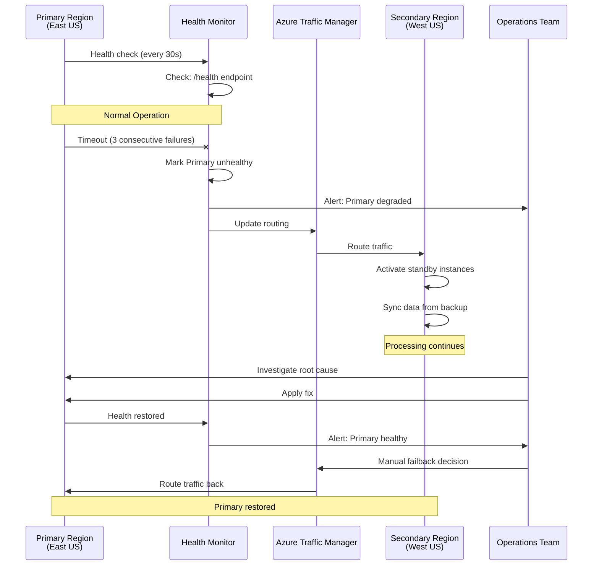

**RTO/RPO Targets:**

| Scenario | RTO | RPO | Cost |
|----------|-----|-----|------|
| **Registry failure** | 5 minutes | 0 (sync replica) | $$$ |
| **Region outage** | 1 hour | 15 minutes | $$$$ |
| **Data corruption** | 4 hours | 1 hour (point-in-time restore) | $$ |

---

## 9. Integration Patterns

### 9.1 Event-Driven Architecture

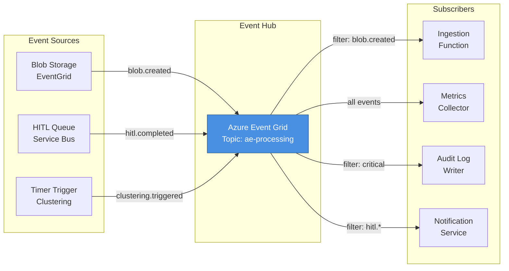

---

## Appendix: Diagram Legend

### Node Shapes

- **Rounded Rectangle**: Process/Operation
- **Diamond**: Decision Point
- **Parallelogram**: Input/Output
- **Circle**: Start/End
- **Hexagon**: Database/Storage

### Color Coding

- **Blue (#4A90E2)**: Core component/primary path
- **Green (#50E3C2)**: Success state
- **Orange (#F5A623)**: Warning/fallback
- **Red (#D0021B)**: Error/failure
- **Purple (#9013FE)**: ML/AI operations

---

## Document Maintenance

**Review Cadence:** Monthly or after significant architecture changes

**Owners:**
- Sajid (Technical Lead): Overall architecture, flows
- Helios (Data/ML): Clustering, fine-tuning flows
- DevOps: Monitoring, failover diagrams

**Feedback:** Submit pull requests or email sajid@thermofisher.com

---

**Next Steps:**
1. Review flows with team in architecture walkthrough
2. Use as reference for component deep-dive designs
3. Keep diagrams synchronized with implementation changes

**Last Updated:** November 4, 2024
